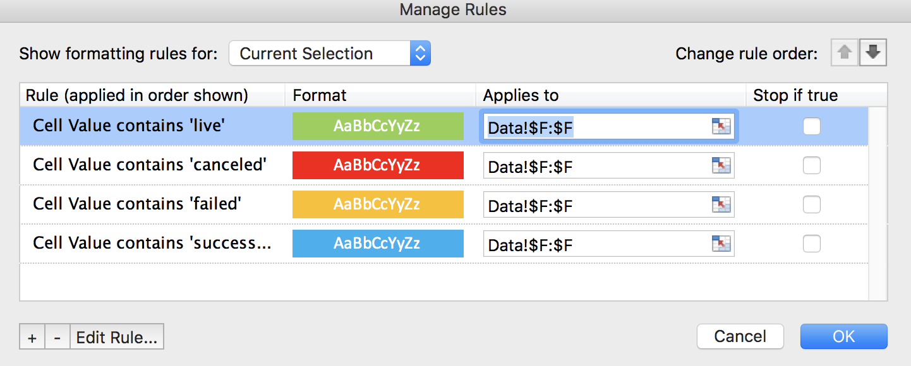
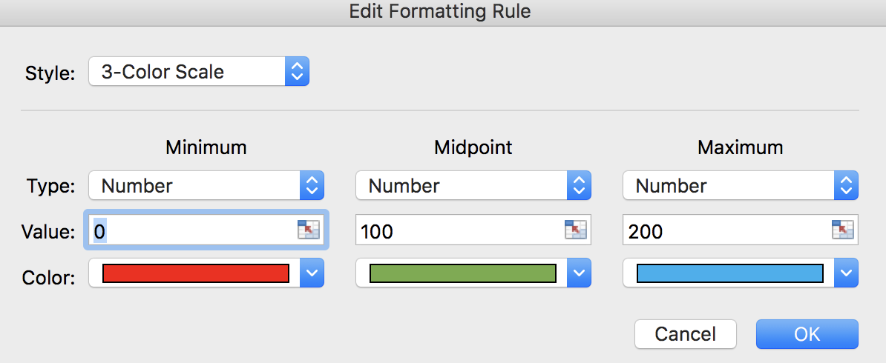
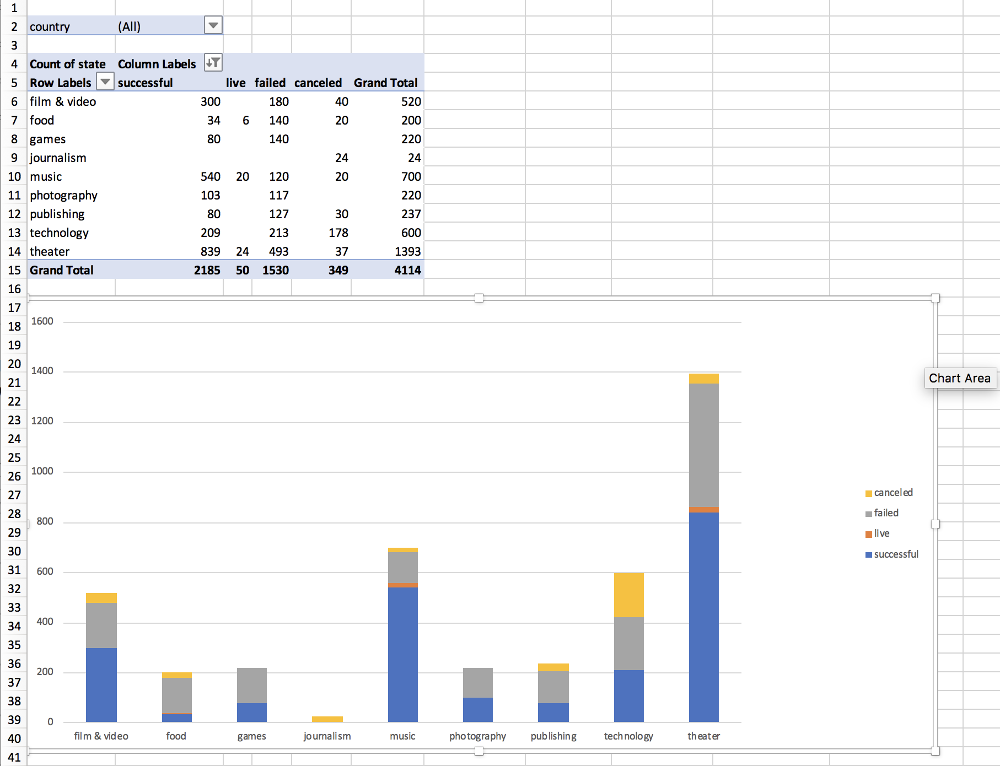
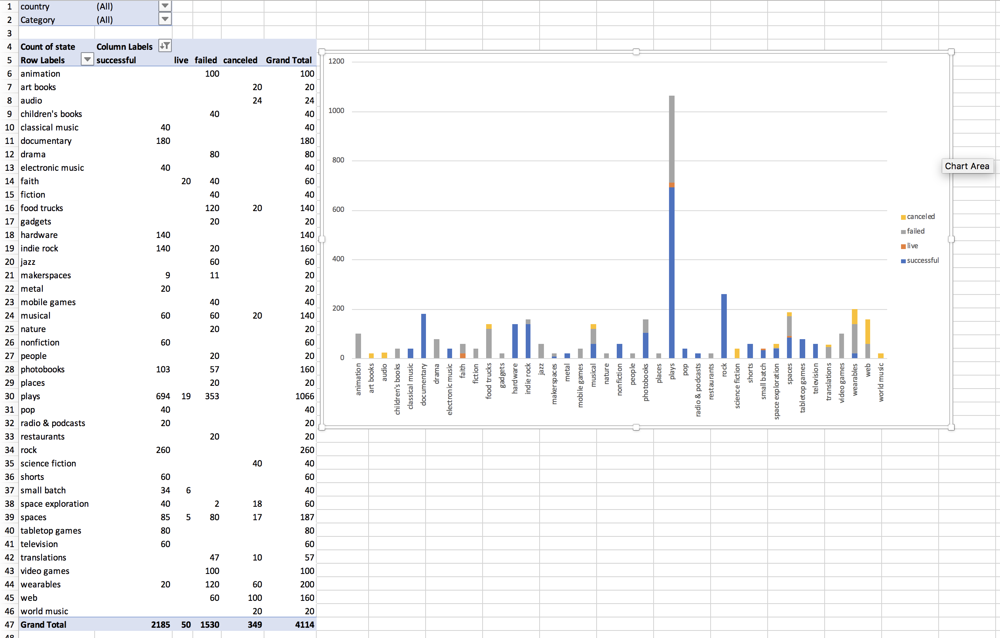
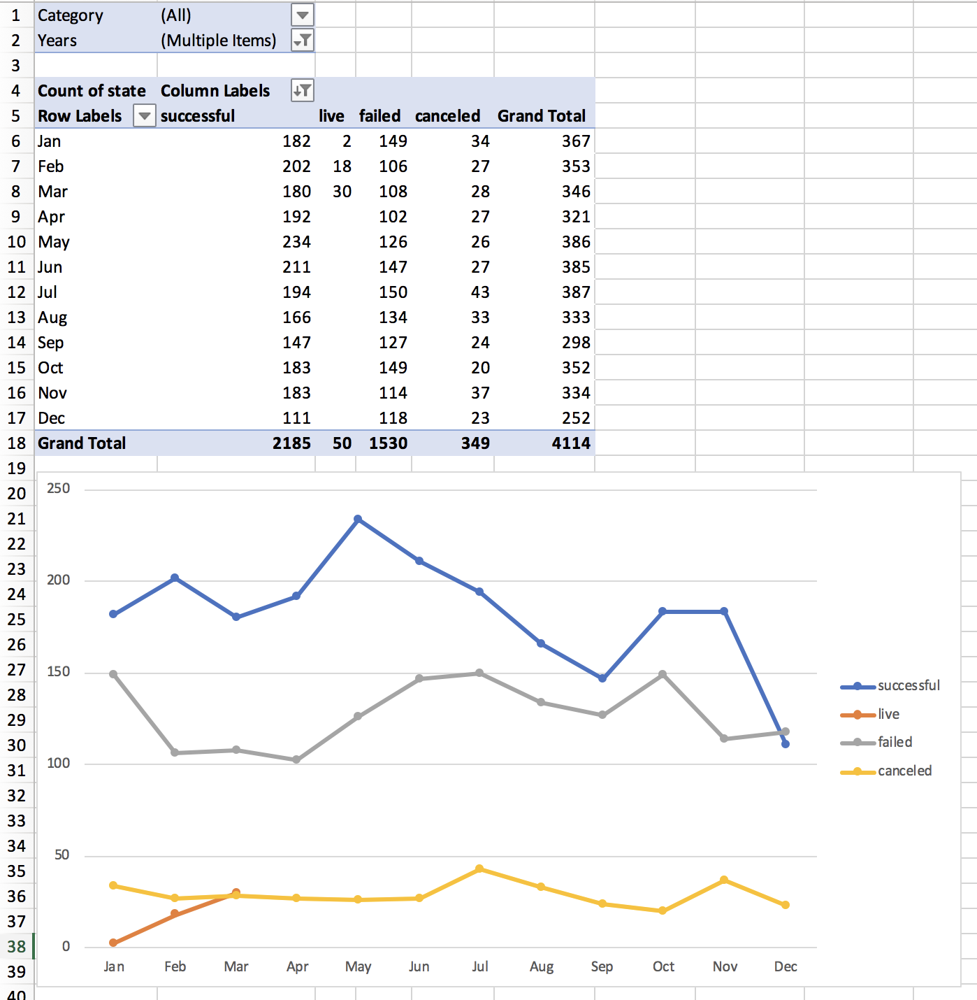

# Excel Homework: Kickstart My Chart
Excel Homework Week 1

### Conditional formating cell"State"
* using the "State" column to show success, failure,or cancelled campaign. 

### Conditional formating cell "Percent Funded"
* using the "Percent Funded" comlumn using a three-color scale: 0 dark shade of red, transitional to green at 100, and blue at 200.

### Stacked column pivot chart filtered by country per cagetory.
This pivot table analyzes the initial worksheet to count how many campaigns were successful, failed, canceled, or are currently live per category.
* Number of campaigns: 
  * Successful
  * Failed
  * Cancelled
  * Currently live
  
  

### Stacked column pivot chart filtered by country and sub-category 
This pivot table analyzes the initial sheet to count how many campaigns were successful, failed, or canceled, or are currently live per sub-category

  
  

### Pivot table by Category & Year
This pivot table with a column of state, rows of Date Created Conversion, values based on the count of state, and filters based on parent category and Years.

  
  

MicroSoft Word document
1. Given the provided data, what are three conclusions we can draw about Kickstarter campaigns? [see Excel Challenge.docx](https://github.com/GiovanniLeonardo/excel-challenge/blob/master/Excel%20Challenge.docx).
2. What are some limitations of this dataset? [see Excel Challenge.docx](https://github.com/GiovanniLeonardo/excel-challenge/blob/master/Excel%20Challenge.docx).
3. What are some other possible tables and/or graphs that we could create? [see Excel Challenge.docx](https://github.com/GiovanniLeonardo/excel-challenge/blob/master/Excel%20Challenge.docx).
